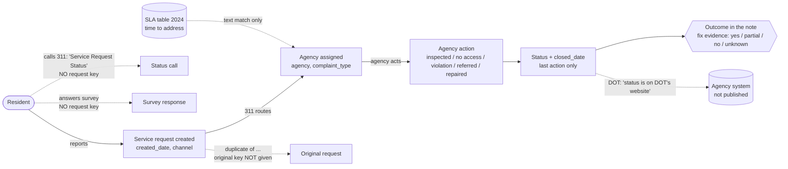
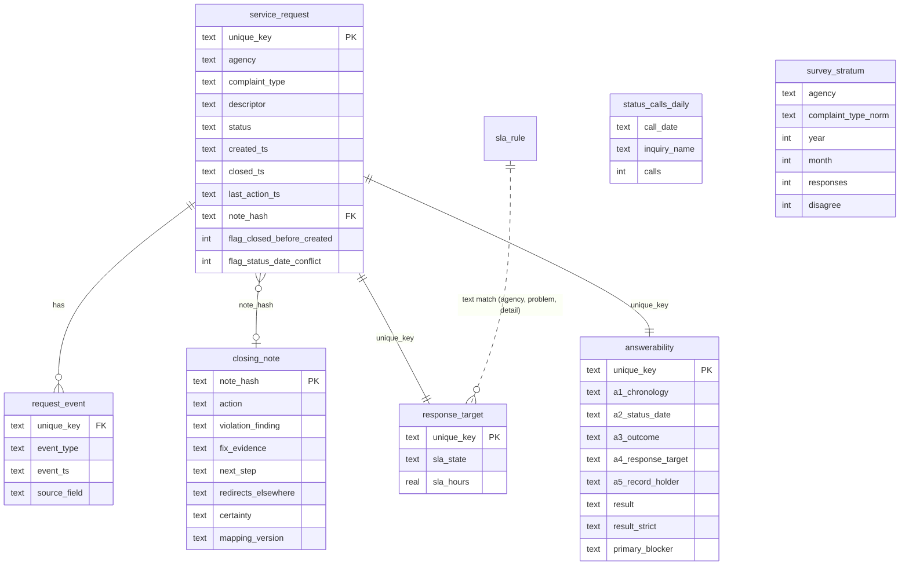
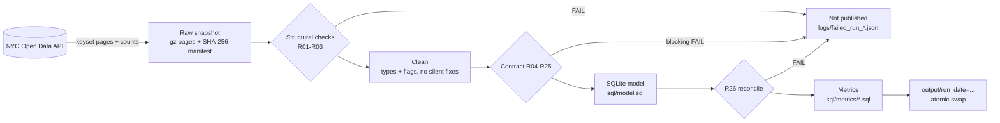

# Workflow and data model

The raw sources are organised by system. The model reorganises them around one request's journey (Class 7).

PNG copies of the three diagrams: `img/workflow.png`, `img/data_model.png`, `img/pipeline.png`.

## 1. The request journey (interaction, intervention, outcome)

Solid lines are links we can join on. Dashed lines are links that exist in the real world but have no key in the data.

| Class 7 concept | In this project | Table |
|---|---|---|
| Entity | service request | `service_request` |
| Events / states | created, last action, closed, due | `request_event` |
| Interaction | resident reports (channel); status calls; survey answers | `service_request.open_data_channel_type`, `status_calls_daily`, `survey_stratum` |
| Intervention | what the agency says it did | `agency_action` (view) from `closing_note.action` |
| Outcome | finding, fix evidence, next step | `closure_outcome` (view) |
| Commitment | published response target | `response_target`, `sla_rule` |
| KPI grain | the five record checks per request | `answerability` |

## 2. Tables

`status_calls_daily` and `survey_stratum` have no relationship lines on purpose: nothing in the data connects them to a request.

## 3. Pipeline

## 4. The five checks behind the KPI

| Check | PASS when | FAIL when | UNKNOWN when |
|---|---|---|---|
| A1 chronology | nothing dated before creation (00:00 same-day stamps excepted) | closed or updated before created | never |
| A2 status/date | Closed has a closed date; others do not | they disagree | never |
| A3 note readable | closed: the note says what happened; open: the note says who acts next | no note, or open with no next step | note not coded, or low certainty (strict: medium too) |
| A4 response target | open request has a MATCHED target (closed: not applicable) | "SLA Not Managed by 311" | AMBIGUOUS or UNMATCHED |
| A5 record holder | note does not send the resident elsewhere | status is only in another system | note not coded |

A request is **answerable** only if every check passes. `primary_blocker` is the first failing check in root-cause order: A1, A2, A5, A3, A4.
